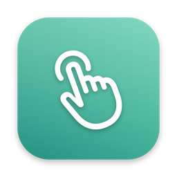
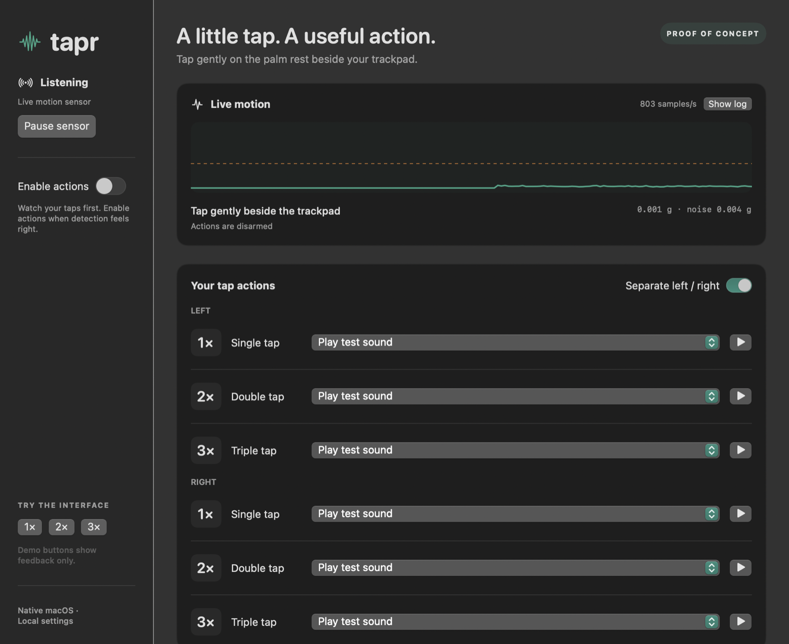
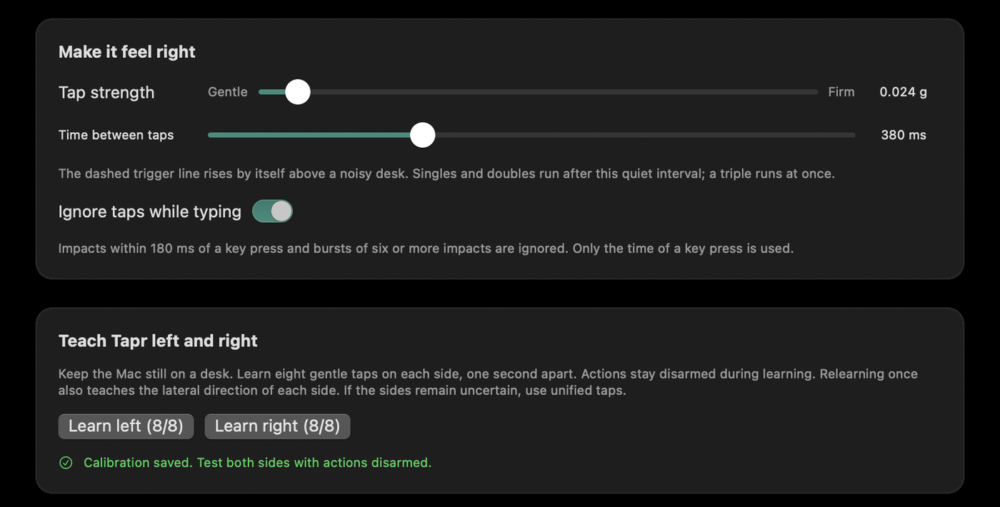

# Tapr

A native macOS proof of concept: gently tap the body of your MacBook to run an action.
Built with SwiftUI/AppKit, a small C/IOKit sensor reader, and no external dependencies.



## Run

```sh
./scripts/build-app.sh
open dist/Tapr.app
```

Requirements: macOS 14+, Swift 5.9+ / Xcode command-line tools, and an Apple silicon
MacBook exposing an AppleSPU accelerometer. Hardware is detected at runtime;
not all Apple silicon Macs have these sensors. The local build is ad-hoc signed,
not notarized or packaged for distribution.

1. Leave **Enable actions** off initially. The live graph should move and show a
   nonzero sample rate. The dashed line is the detection threshold.
2. Gently tap on the palm rest next to the trackpad. Start with a double tap.
   The recognized count appears underneath the graph after a quiet interval.
3. Adjust **Tap strength**. Move toward Firm if desk bumps trigger detection,
   or toward Gentle if your taps are missed. Adjust the interval for your rhythm.
   Leave **Ignore taps while typing** on; it needs Accessibility access to see
   key presses (see below).
4. Leave the action set to **Play test sound**, then enable actions. A recognized
   tap sequence should play the system Pop sound.
5. Assign other actions once detection is reliable enough for your setup.

The app remains available from the menu bar when its window closes. Quit from
that menu or with Cmd-Q. Pause stops sensor reading and disarms actions. Actions
also start disarmed on every launch and after sleep.

## Actions

Each single/double/triple gesture can play a sound, do nothing, run a named Apple
Shortcut, open a website, open an app, invoke screenshot selection, copy/paste,
or send play/pause, mute, or volume controls. Click the small play button beside a
mapping to execute it immediately, even with automatic actions disarmed.
Keyboard actions target the currently focused application.

- Enter an exact Shortcut name. It runs through `/usr/bin/shortcuts run` using
  separate process arguments; there is no shell command interpolation.
- Keyboard and media actions need Tapr enabled under **System Settings → Privacy
  & Security → Accessibility**. Use the Enable button in the app to request it.
- Actions may need their own permissions. Shortcuts can request input/permission;
  another action is not launched while a Shortcut is still running.
- The sidebar demo buttons only update the interface. They neither run actions
  nor prove that physical tap detection works.

## Typing, noise and latency

These three mechanisms follow the open-source MacTap detector
(https://github.com/jaskirat1616/mactap-app), which reads the same sensor.

- **Typing.** Tapr installs a global key-down monitor while listening and the
  toggle is on. Only the time of the last key press is kept, never the key. An
  impact from 180 ms before to 60 ms after a key press is ignored (`typing_key`,
  or `typing_vertical` when it is also a purely vertical impulse). Six impacts
  inside 420 ms lock detection for 280 ms and clear pending taps
  (`typing_burst`, `typing_lockout`); this works without any permission. The
  global monitor only delivers events while Tapr has Accessibility access; the
  tuning card warns when it does not.
- **Noise.** The detector keeps an adaptive noise floor from samples below 90%
  of the configured threshold, clamped to 0.0035–0.030 g. The trigger level is
  the configured threshold or 2.2 times that floor, whichever is higher; the
  dashed line in the graph shows the effective value. Impacts below 1.6 times
  the floor are dropped as `low_snr`.
- **Latency.** A third tap fires immediately instead of waiting for the quiet
  interval. Impacts that follow a triple are dropped until the interval has been
  quiet (`after_triple`), so a fast run of taps never becomes a triple plus a
  single. Singles and doubles still wait for the interval.



## Optional left/right gestures

Start with **Separate left / right** off: all taps use the same three mappings.
To try six mappings, enable it, then use **Learn left** and **Learn right**.
After each button click, wait two seconds, then make eight taps on that side,
roughly one second apart. Actions stay disarmed during calibration. Test both
sides with actions disarmed before enabling them.

Calibration uses weighted acceleration and angular-velocity samples over each
40 ms impact, captured at a requested 800 Hz. Each side needs eight examples.
Recognition projects a tap onto one separating axis: the difference between the
learned left and right means, weighted by the inverse spread of each dimension.
On the logged hardware this axis is dominated by the roll rate, so the pitch
direction, which flips between otherwise similar taps, no longer matters. The
projection becomes a vote from -1 (right) to 1 (left). Since 0.1.5 each
signature carries a seventh value: the lateral (x) motion over the first 34 ms,
after subtracting the pre-tap baseline, the feature MacTap uses on its own.
Calibrations learned before 0.1.5 have six values and keep working; the seventh
is then ignored. Relearn once to include it. On 61 labelled taps from this
machine the seventh value did not change the result (one disagreement either
way), so relearning is optional. A single tap needs |vote|
>= 0.35; the votes of a double or triple are summed, so one uncertain tap inside
a confident burst no longer discards it. Bursts with strong votes for both
sides, or more than three taps, are still rejected. Learning is accepted only
when at least 75% of each side's examples, held out one at a time, land on their
own side decisively and resemble the rest of their side. This is an
experimental classifier, not validated left/right accuracy. If learning fails
or sides are confused, relearn on a stable surface or use unified tap mappings.
Moving the Mac to another surface can change the signal.

Since 0.1.4 the angular velocity inside an impact is measured relative to its
slow baseline, frozen at onset. Recorded windows showed the chassis still
rolling back at 3–4°/s 200 ms after a left tap, which pushed the second and
third tap of fast left triples to the wrong side. Calibration taps are made one
second apart, where that residual is near zero, so learned examples stay valid.

Version 0.1.1 requires fresh side calibration because the features changed.
Versions 0.1.3 to 0.1.5 change only the classifier, the gyro baseline and the
optional seventh value and keep 0.1.1/0.1.2 calibration data. Existing action mappings and sensitivity
settings are preserved.

Sustained rotation/translation cancels pending gestures and pauses detection
until the laptop settles. The sidebar shows **Hold the laptop still — taps
paused** during that period. Rotation is judged on a 100 ms low-pass of the
signed angular velocity (above 8°/s for 80 ms), so the ringing and brief tilt
caused by a tap itself average out; before 0.1.3 the raw rate above 6°/s tripped
the gate on many firm taps and paused detection for 0.65 s each time. Brief
sharp bumps can still resemble intentional taps; this is not a guarantee
against every unwanted action.

## Diagnostics and tests

```sh
./scripts/test.sh
./dist/Tapr.app/Contents/MacOS/Tapr --probe
```

The probe opens the sensors for three seconds and reports sample counts and
acceleration magnitude, without executing actions. Run it from a normal Terminal,
not an agent/app sandbox. The GUI also reports zero-sample and access failures.
Do not run multiple sensor apps/probes simultaneously: the undocumented driver
reporting settings are shared. Quit Tapr before using `--probe`.

Version 0.1.2 adds decision logging without changing detector thresholds or
invalidating calibration. **Show log** reveals `~/Library/Logs/Tapr/events.jsonl`.
The log rotates at 2 MiB and retains one previous file. It records sensor rates,
sample gaps/delay, motion-gate transitions, impact strength/signature, left/right
scores, accepted/rejected sequences, and action dispatch/skip reasons. It does
not record keyboard contents, Shortcut names, app paths, or website addresses.
File writes run off the main thread. The same events go to macOS unified logging:

```sh
log stream --level default --predicate 'subsystem == "local.tapr.poc"'
```

Version 0.1.3 adds `~/Library/Logs/Tapr/impacts.jsonl` (rotates at 8 MiB,
one previous file): for every completed impact, the raw accelerometer and
gyroscope samples from 40 ms before to 100 ms after onset, the signature, the
side vote and, during learning, the side label. This is the material for
designing better features offline; nothing reads it at runtime. Tap events now
carry `vote` instead of `left_score`/`right_score`, plus `snr`, `noise_g`,
`attack_x_g` and `attack_z_g`. Rejected sequences name their reason
(`uncertain_side`, `mixed_sides`, `mixed_modes`); rejected impacts are logged as
`tap_rejected` with `low_snr`, `typing_key`, `typing_vertical`, `typing_burst`,
`typing_lockout` or `after_triple`, and their raw windows carry `label`
`rejected`.

```sh
scripts/analyze-log.py            # per-launch summary of taps, votes, bursts, gestures, gate trips
```

Older versions did not log tap decisions, so their unified logs cannot explain
which detector stage rejected a particular tap. Synthetic test success and a
healthy sample rate do not establish physical recognition reliability.

For a UI smoke test (renders only Tapr's own content and exits; the optional
second argument is the delay in seconds, default 3):

```sh
./dist/Tapr.app/Contents/MacOS/Tapr --smoke-test /tmp/tapr-preview.png 6
```

`docs/screenshot.png` is such a capture. The app icon is rendered from an SF
Symbol by `scripts/make-icon.sh`, which writes `Resources/AppIcon.icns` and
`docs/icon.png`; `scripts/build-app.sh` copies the icon into the bundle.

Automated tests cover motion warmup, steady-state noise, damped impacts,
multiple-tap timing, mixed/unknown/excess tap rejection, state reset, and basic
calibration behavior. They use synthetic signals. Real typing rejection and
left/right recognition need hands-on testing; this POC does not yet monitor
keyboard activity to suppress typing or train a general gesture model.

Local validation for 0.1.1 (2026-09-08, macOS 27 beta, arm64): 15 tests passed, the release
app built and passed signature/plist checks, and a GUI smoke test showed live
motion at 803 samples/s with actions disarmed. Tests include movement cancelling
pending taps, settling, and ambiguous side calibration. Both accelerometer and
gyroscope have produced live samples without root.

Version 0.1.3 (2026-09-08) was driven by a logged 0.1.2 session on the same
machine: of 172 detected impacts only 87 received a side, 55 of 91 bursts were
rejected, and the motion gate tripped 81 times on tap-induced rotation,
cancelling 22 queued taps. Replaying the new classifier and burst voting on
those logged signatures classifies most previously uncertain taps, and the
stored calibration stays valid. A 90 s hands-on session with 0.1.3 then showed
56 of 58 impacts with a decisive side, 31 gestures from 30 bursts, six triples,
and no motion-gate trips. Three of the fast left triples were still rejected
as `mixed_sides` although every tap was on the left. Version 0.1.4
(2026-09-09) removes the pre-onset roll residual that caused this: replaying
the recorded impact windows, wrong-side votes drop from 4 to 1 of 61 labelled
taps and no vote stays below 0.35. 23 tests pass and the release app builds.
Version 0.1.5 (2026-09-09) adds the MacTap-style typing suppression, adaptive
noise floor, immediate triples and the lateral side value; 30 tests pass and
the release app builds. The typing suppression and noise floor have not been
tried hands-on yet; synthetic tests and log replay do not establish real-world
recognition accuracy.

## Development

The repository is a plain Swift package. `scripts/test.sh` runs the unit tests,
`scripts/build-app.sh` produces the ad-hoc signed bundle in `dist/`. GitHub
Actions (`.github/workflows/ci.yml`) runs both on every push and pull request on
a macOS runner, verifies the bundle, checks that `--probe` exits cleanly without
a sensor, and uploads `Tapr.app` as a build artifact. Commit messages follow
`<type>: <description>` (feat, fix, refactor, docs, test, chore, perf, ci).

Beta exit criteria, all measured from `~/Library/Logs/Tapr/events.jsonl` with
`scripts/analyze-log.py`: one week of daily use with actions armed on the test
sound and no unintended action during typing; intentional bursts recognized at
95% or better and sides correct at 97% or better over at least 200 taps; motion
gate trips only while the laptop moves; five sleep/wake cycles without restart;
known energy impact; one additional Mac model.

## Implementation and limits

- `Sources/CSensor`: opens only accelerometer/gyro HID devices, enables their
  reporting at a requested 800 Hz, and decodes timestamped 22-byte reports.
  Stop/quit closes the readers and attempts to restore the prior reporting
  properties. No daemon, root helper, login item, or driver is installed.
- `Sources/TaprCore`: high-pass impact detection with the adaptive noise floor
  (`Detection.swift`, `Attack.swift`), burst grouping with side votes
  (`Gestures.swift`), side calibration (`SideCalibration.swift`), the typing
  guard (`TypingGuard.swift`) and the motion gate. Actions wait until the
  configured quiet interval expires; bursts of more than three taps and
  sequences with strong votes for both sides are ignored.
- `Sources/Tapr`: native UI, locally persisted mappings/calibration and actions,
  and the key-down monitor (`KeyboardActivity.swift`), which stores timestamps only.
  Settings live in UserDefaults under `local.tapr.poc`. No network requests or
  telemetry are implemented by Tapr; configured website/Shortcut actions may use
  the network.

The sensor protocol and reporting properties are undocumented and may change
with macOS updates. Local sensor access worked without root; this is not a
compatibility guarantee for other machines/OS versions. This is a directly run,
unsandboxed POC, not a Mac App Store submission. Battery impact, additional
hardware models, all action integrations, and long-running reliability have not
been benchmarked or comprehensively tested.

Protocol reference: [apple-silicon-accelerometer](https://github.com/olvvier/apple-silicon-accelerometer).
Shortcut integration: [Apple's command-line documentation](https://support.apple.com/guide/shortcuts-mac/run-shortcuts-from-the-command-line-apd455c82f02/mac).
